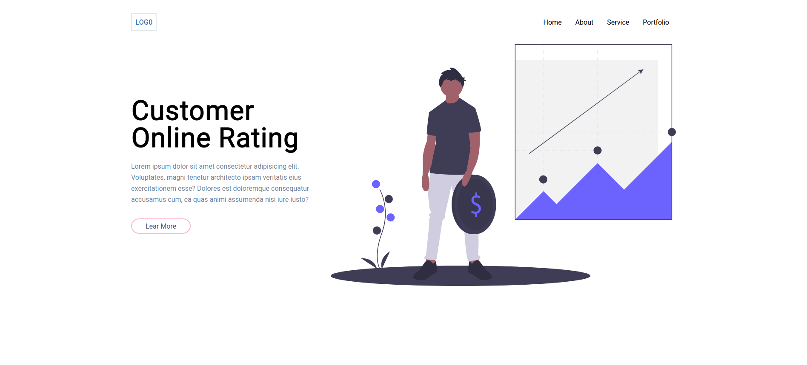

Belajar Design Menggunakan Tailwind

- [Tailwind CSS](https://tailwindcss.com/)



## Gettng Started

Persiapan NPM

```
npm init
```

Install Modules yang dibutuhkan

```
npm install
```

Build project

```
npm run build:css
```

watch -nodemon

```
npm run serve
```

> NB: saya sudah menginstal nodemon secara global di komputer saya
> [install nodemon](https://www.npmjs.com/package/nodemon)
> npm install -g nodemon

## Belajar

- Membuat Button
- Custom Button
- Grid System
- Menjalankan Custom Script di NPM

## Logs

```
npx tailwindcss init
```

Created Tailwind config file: tailwind.config.js

## Membuat Konfigurasi Sendiri

Prefix rg-

```
module.exports = {
  prefix: "rg-",
  ..
```

jadi agar setiap kode harus diawali `rg-` misal: `rg-container`.
